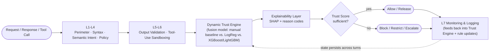

# Explainable Multi-Layer LLM Firewall with Dynamic Trust Scoring

**An explainable, stateful multi-layer security gateway for LLMs and AI agents.**
A model-agnostic middleware pipeline inspects every prompt, response, and tool
call passing through an LLM application, fuses evidence from seven security
layers into a single **Dynamic Trust Score**, and explains — in human-readable
terms — why that score changed, rather than issuing an opaque allow/deny
verdict.

## Overview

Most LLM firewalls evaluate each request in isolation with static, hand-tuned
rules. This pipeline treats security as a **continuous, stateful process**
instead of a one-off check:

1. **Screens & analyzes** every request across six defense layers — traffic
   control, syntactic screening, semantic intent classification, policy and
   context enforcement, output validation, and tool-use sandboxing.
2. **Fuses** the resulting evidence — content, intent, source, permission,
   action/tool risk, and conversation history — into a calibrated **Trust
   Score** and **Trust Vector**, using a learned model rather than fixed
   manual weights.
3. **Explains** the decision via SHAP attributions (for the learned model)
   combined with explicit reason codes (for deterministic rules), and tags
   every piece of content with its **source provenance** (system/developer
   vs. user, retrieval, or tool output) so trusted instructions are never
   confused with untrusted content.
4. **Adapts** access — to outputs, data, and tools — in real time as trust
   rises or falls across the conversation, and logs everything for audit and
   feedback-driven retraining.

The firewall — not a fixed rule chain — decides how much trust a session has
earned so far and what that trust permits next. That continuous re-evaluation
is what makes it stateful rather than a stateless filter with an ML model
bolted on.

## How it works

Each of the seven layers acts as an **evidence-producing component**, not an
independent pass/fail gate. The Dynamic Trust Engine is the actual decision
maker: it maintains a running Trust Score and a multi-dimensional Trust
Vector per session, updates them turn by turn, and lets a severe event (e.g.
a privilege violation) sharply cut trust immediately rather than waiting for
the next full recalculation.

## Tools / Layers

| Layer | Tool | Purpose |
|---|---|---|
| **L1** | Perimeter & Traffic Control | Authentication, rate limiting, request-size caps, traffic throttling |
| **L2** | Syntactic Prompt Screening | Keyword/regex/attack-signature matching, normalization of encoded or obfuscated input, format checks |
| **L3** | Semantic Intent Analysis | Fine-tuned classifier, embedding similarity, multi-turn context analysis for jailbreak/prompt-injection detection |
| **L4** | Policy & Context Enforcement | Permissions, system-prompt integrity, trusted/untrusted context separation, retrieval-content sanitization |
| **L5** | Output Validation | PII/secret leakage checks, harmful-content checks, schema validation |
| **L6** | Tool-Use & Action Sandboxing | Function allow-listing, argument validation, sandboxing, human approval, capability restrictions |
| **L7** | Monitoring, Logging & Adaptive Learning | Audit logs, anomaly monitoring, dashboarding, feedback loop for updating rules/classifiers |
| **Trust Engine** | Fusion model (manual weights / Logistic Regression / XGBoost / LightGBM) | Combines all layer evidence into a Trust Score + Trust Vector |
| **Explainability** | SHAP + reason codes | Explains why trust changed, for both learned and rule-based signals |
| **Provenance Tagger** | Source tagging across the pipeline | Distinguishes trusted system/developer instructions from untrusted user/retrieval/tool content |

## Features

- **Stateful trust, not one-off checks** — the Trust Score persists and
  evolves across a session instead of being recalculated from only the
  current message.
- **Multi-dimensional Trust Vector** — content, intent, source, permission,
  action/tool risk, and history are tracked separately, so two sessions with
  the same overall score can be distinguished by *why* they got there.
- **Learned fusion, empirically justified** — the final scoring model is
  chosen by comparing a manual weighted baseline against Logistic Regression
  and XGBoost/LightGBM, not assumed.
- **Explainable by design** — every trust-affecting decision has a
  human-readable explanation, whether it came from the ML fusion model
  (SHAP) or a deterministic rule (reason code).
- **Source-provenance aware** — instructions are tagged by origin so
  indirect prompt injection via retrieved or tool content can't silently
  masquerade as a trusted system instruction.
- **Detects multi-turn attacks** — slow-drip prompt injection, gradual
  privilege escalation, and role-play-based jailbreaks are visible to the
  Trust Engine precisely because it looks across turns, not just at the
  current one.

## Scope and safety

This project is evaluated against adversarial prompt-injection and
privilege-escalation test sets in a controlled environment, benchmarked
against rule-based, classifier-only, and static multi-layer baselines. It is
a coursework research project, not a production-hardened security product.

## Known limitations

- **Hallucination/factual-consistency checking is explicitly out of scope**
  for L5 — that layer is scoped to security leakage, policy, and schema
  validation, not factual accuracy.
- **The seven layers are evidence sources, not the novelty.** Each layer
  individually uses established techniques; the research contribution is the
  stateful, explainable trust-fusion mechanism on top of them.
- **Fusion model performance depends on training data quality** — the
  comparison between manual weights and learned models (LogReg,
  XGBoost/LightGBM) is only as reliable as the adversarial dataset used to
  train and evaluate them.
- **Explanations describe the model's reasoning, not ground truth** — SHAP
  attributions and reason codes explain *what drove the score*, which is not
  the same as a guarantee that the score itself is correct.
